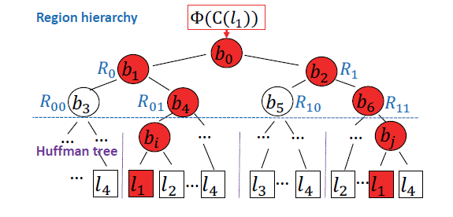

# Geographical Latent Representation for Predicting Future Visitors #

## main work ##

- They use **latent model** incorporating the geographical influence of POIs.In fact,they use word2vec to realize it. Their work is getting the probability of a user $u$ visiting a POI $l$ considering of the previous POI $C(l)$ the user $u$ visited.It is defined with a SoftMax function:$$Pr(l|C(l)) = e^{(w(l)\cdot\Phi(C(l)) )}/Z(C(l))$$

  Here,$w(l)$ is the latent vector for POI $l$ and $\Phi(C(l)) = \sum_{l_{c}\in C(l)}w(l_{c})$ means the sum of vector of contextual POIS.

  In order to reduce the computation of $Z(C(l))$, it use hierarchical SoftMax function.

- They use a binary tree to realize hierarchical SoftMax and use Huffman tree to construct the binary tree.Because Huffman tree can get shortest average path if we construct it based on the frequency of the distribution of POI.In order to **incorporating Geographical Influence**, they use several steps to construct binary trees.

  First, they split the POIs into a hierarchical of binary regions.

  Second, they assign a POI to multiple regions by considering the influence of a POI.

  Finally, they  construct a Huffman tree on each region.

  Then, we can get the new hierarchical SoftMax function $Pr(l|C(l)) = \prod_{path_{k} \in{P(l)}}Pr(path_{k})\times Pr(l|C(l))^{path_{k}}​$ to replace the normal SoftMax function.

  Finally,we maximize the posterior probability.So we can get:$\Theta = argmax_{(W(\mathcal{L}),\Psi(B))}\prod_{(l,C(l))\in \mathcal{H} Pr(l|C(l))}Pr(l|C(l))$.Here, $W(\mathcal{L}) $ represent the latent representations of all the POIs and $\Psi(B)$ represent the latent representations of inner nodes.

- 

  

  

  

---

## Question ##

1. What is POI? How we realize it in the code?

   POI is Point of Interest. It means a place.

2. What is SoftMax?

